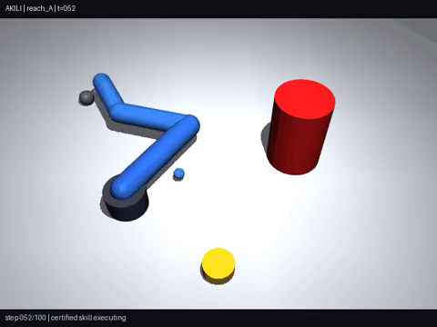
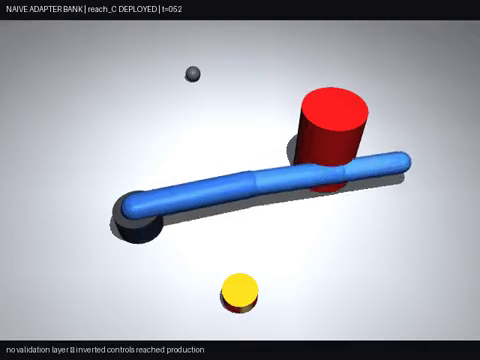
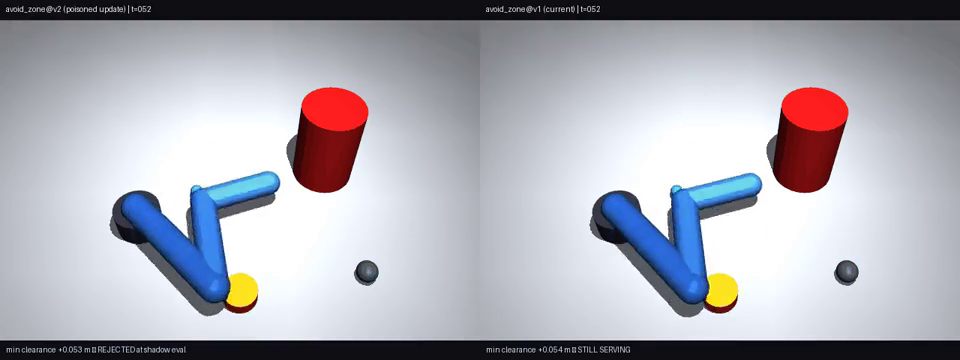
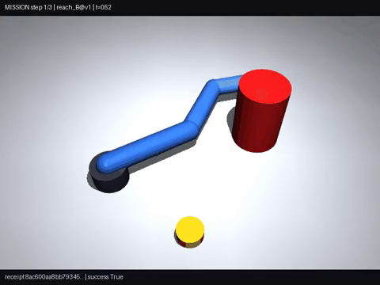

# Akili Runtime

**A versioned continual-capability runtime for safe, resource-bounded adaptation.**

> Akili turns new experience into isolated learned capabilities, validates each candidate before production activation, manages active/dormant/rolled-back states, and records a tamper-evident path back to every certified safe state.

**Release status:** `v0.1.0-rc4` — public release candidate with verified three-seed CPU robotics evidence, verified Agent Evolution lifecycle evidence, and a validated matched-feature CIFAR-100 comparison. The raw five-system Agent comparison JSON remains pending import before final `v0.1.0`.

## Why Akili

Adapters, replay, registries, RAG, and rollback already exist. Akili does not claim to have invented those components. It tests an integrated runtime contract:

```text
experience or correction
→ candidate learned capability
→ behavioral and safety admission
→ versioned activation
→ active / dormant / rolled-back lifecycle
→ bounded adaptive state
→ compatibility re-certification
→ auditable recovery
```

Akili is a **continual-learning runtime with pluggable learning engines**, not one monolithic continual-learning algorithm.

## Two flagship demonstrations

| Track | Evidence | Status |
|---|---|---|
| **MuJoCo Robotics Benchmark v1 (CPU)** | 3 seeds; 4 skills certified per seed; 11/12 skill–seed evaluations at 1.00; 99.5% overall mean; unsafe v2 rolled back; certified three-step missions; frozen trunk; 112.7 KiB skill bank | **Verified LITE publication evidence included** |
| **Agent Evolution Benchmark v1 (GPU/LLM)** | 43/43 hard checks; 24-entry verified audit chain; 4 ACTIVE, 3 DORMANT, 1 ROLLED_BACK; malicious candidate blocked | **Verified lifecycle publication evidence included; full comparison JSON pending** |
| Kimi LLM v0.1/v0.2 | Registries, manifests, audit logs, reports | Development evidence; original failures preserved |
| **Split CIFAR-100 v0.22.3 matched DER++** | Akili 62.52% ± 0.19 vs DER++-400 22.16% ± 3.09; forgetting 10.34% vs 71.70%; same frozen features, task orders, 400-example memory, α=β=0.5 | **Validated project summary; raw run bundle and independent Mammoth replication pending** |
| Split CIFAR-100 v0.23 | 62.55% final baseline; 75.28% top-2 union; 80.22% top-3 union; no safe arbiter selected | Null result / capacity diagnostic |
| DER++ / ER / ER-ACE | Official Mammoth runner included | Real matched runs pending |

See [EVIDENCE.md](EVIDENCE.md) and [docs/CLAIMS_LEDGER.md](docs/CLAIMS_LEDGER.md).

## CPU flagship: MuJoCo robotics

Three independent seeds ran the same lifecycle on CPU. Every seed:

- trained isolated low-rank skill adapters while keeping the trunk frozen;
- blocked a poisoned candidate before activation;
- rejected `avoid_zone@v2` and kept `avoid_zone@v1` serving with zero downtime;
- completed a certified three-step mission;
- passed cold restart, write-once, audit-chain, and forensic checks.

| Metric | Result |
|---|---:|
| Safe skills certified | **4/4 in every seed** |
| Perfect skill–seed evaluations | **11/12 at 1.00** |
| Non-perfect evaluation | **`press_button@v1`, seed 1: 0.94** |
| Overall mean across 4 skills × 3 seeds | **99.5%** |
| Hard-check result | **all seeds passed** |
| Unsafe update state | **ROLLED_BACK in all seeds** |
| Sequential FT retention of first skill | **100% → 0%** |
| Parameters per adapter | **2,048** |
| Adapter size relative to trunk model | **11.4%** |
| Akili skill bank | **112.7 KiB** |
| Four isolated models | **290.5 KiB** |
| GPU required | **none** |

### Canonical seed-0 demo set

| Learn skills | Sequential forgetting | Naive bank | Update rejected | Certified mission |
|---|---|---|---|---|
| [](results/publication/robotics_mujoco_v0_2/demo_seed_0/act1_skills.mp4) | [](results/publication/robotics_mujoco_v0_2/demo_seed_0/act2_forgetting.mp4) | [](results/publication/robotics_mujoco_v0_2/demo_seed_0/act3_naive_bank.mp4) | [](results/publication/robotics_mujoco_v0_2/demo_seed_0/act4_update_rejected.mp4) | [](results/publication/robotics_mujoco_v0_2/demo_seed_0/act5_mission.mp4) |

This is a small synthetic MuJoCo/kinematic-policy experiment. It is not a sim-to-real or production robotics claim.

## GPU flagship: Agent Evolution

| System | Current accuracy | Stale error | Attack rate | Historical recovery |
|---|---:|---:|---:|---:|
| **Akili** | **100.00%** | **0.00%** | **0.00%** | **100.00%** |
| Naive adapter bank | 100.00% | 0.00% | 100.00% | — |
| Shared LoRA | 25.00% | 15.00% | 1.25% | — |
| Shared LoRA + tiny replay | 91.56% | 8.44% | 100.00% | — |
| RAG current documents | 0.00% | 12.19% | 0.00% | — |

The result supports a narrow claim: Akili admitted legitimate revisions, suppressed obsolete behavior, rejected a clean-capable malicious update before activation, kept the prior safe version serving, and recovered dormant historical versions while the frozen base remained unchanged.

The raw hard checks, repair receipt, registry, and 24-entry audit log are now imported and independently verified as lifecycle publication evidence. The five-system metric table above remains reported evidence until the correct full comparison JSON is imported; the 320-example TF-IDF router summary is not that comparison.

## Matched CIFAR-100 result: Akili versus DER++

Under the matched frozen-feature protocol—Split CIFAR-100 Class-IL, 10 tasks × 10 classes, Seeds 1/2/3, the same frozen ResNet-50 ImageNet1K-V2 features, the same task orders, the same 400-example memory capacity, and DER++ coefficients α=β=0.5—the implemented comparison produced:

| Method | Final Class-IL | New-task accuracy | Average forgetting |
|---|---:|---:|---:|
| Sequential linear | 8.82% ± 0.29 | 88.13% | 87.55% |
| ER-400 linear | 9.48% ± 0.29 | 88.43% | 86.96% |
| **DER++-400 linear** | **22.16% ± 3.09** | **88.70%** | **71.70%** |
| One-prototype NCM | 58.14% ± 0.03 | 56.50% | 11.29% |
| **Akili routed** | **62.52% ± 0.19** | — | **10.34%** |
| **Akili oracle** | **79.38% ± 0.87** | — | **0.00%** |

Akili exceeded DER++-400 by **40.36 percentage points** in final Class-IL accuracy (2.82×) and reduced average forgetting by **61.36 points** under this implemented matched protocol.

**Required interpretation:** an eight-prototype semantic-only diagnostic reached **62.55% ± 0.05**, essentially matching Akili routed. The demonstrated automatic win is primarily attributable to stable write-once semantic memory, not yet to unique gains from the full expert-routing stack. The frozen expert bank remains valuable because it preserves **79.38% ± 0.87 oracle capability with zero oracle forgetting**, leaving capability that current automatic arbitration does not recover.

**Resource boundary:** the match covers frozen features, task orders, 400 stored examples, and DER++ coefficients. It does not establish equal total adaptive-state bytes because Akili also stores adapters and semantic prototypes. The independent Mammoth track will report total adaptive-state bytes and larger-buffer DER++ arms.

See [results/reported/cifar100_v0_22_3_matched_derpp](results/reported/cifar100_v0_22_3_matched_derpp).

## Quickstart

```bash
python -m venv .venv
source .venv/bin/activate
pip install -e .
python examples/minimal_lifecycle.py
python -m unittest discover -s tests -v
```

## Repository map

```text
akili-runtime/
├── src/akili_runtime/                  # registry, policy, audit, budgets
├── examples/                           # dependency-light lifecycle example
├── experiments/
│   ├── agent_evolution/                # final audited LLM code
│   ├── llm_skill_runtime/              # Kimi v0.1/v0.2 lineage
│   └── robotics_mujoco/                # exact CPU notebook
├── benchmarks/split_cifar100/          # retrieval study + Mammoth runner
├── results/
│   ├── publication/robotics_mujoco_v0_2/
│   ├── publication/agent_evolution_v1/  # verified lifecycle subset
│   ├── reported/agent_evolution_v1/     # full comparison still reported
│   ├── reported/cifar100_v0_22_3_matched_derpp/
│   └── development/                    # null/negative evidence
├── docs/                               # architecture, claims, limits, lineage
└── tools/                              # evidence collection and release audit
```

## Reproduce

- Runtime tests: [REPRODUCE.md](REPRODUCE.md)
- Robotics evidence: [results/publication/robotics_mujoco_v0_2](results/publication/robotics_mujoco_v0_2)
- Colab operations: [docs/COLAB_OPERATIONS.md](docs/COLAB_OPERATIONS.md)
- Agent Evolution: [experiments/agent_evolution](experiments/agent_evolution)
- Split CIFAR-100 / DER++: [benchmarks/split_cifar100](benchmarks/split_cifar100)

## Remaining release blockers

Before the final `v0.1.0` tag:

1. import the correct raw Agent Evolution five-system comparison JSON and reconcile it with the four verified lifecycle files;
2. replace the Zenodo/DOI placeholder after archive creation.

The clean stranger test, Apache-2.0 migration, branch cleanup, Agent lifecycle import, and matched v0.22.3 DER++ documentation are complete. Independent Mammoth replication remains a post-v0.1.0 research milestone.

## Author and commercial contact

**Irénée Akilimali** — independent builder in Kinshasa, Democratic Republic of the Congo.  
Pilots, paid support, integrations, sponsorships, and partnerships: **shukranimungu@gmail.com**

## License

Akili Runtime is open-source software licensed under the [Apache License 2.0](LICENSE).
The license permits research, modification, redistribution, and commercial use subject to its terms, including preservation of required notices.

- License text: [LICENSE](LICENSE)
- Attribution notices: [NOTICE](NOTICE)
- Commercial use, paid support, pilots, and partnerships: [COMMERCIAL_USE.md](COMMERCIAL_USE.md)
- Name and trademark policy: [TRADEMARK.md](TRADEMARK.md)

Commercial use does **not** require separate permission. For paid support, integration, pilot, sponsorship, or partnership discussions, contact **shukranimungu@gmail.com**.
